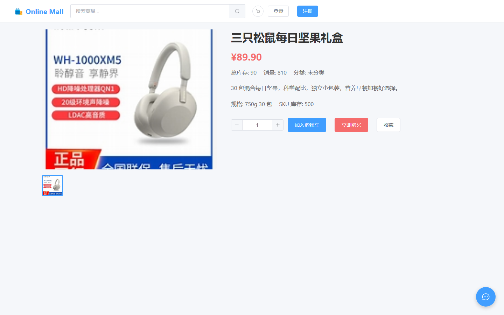
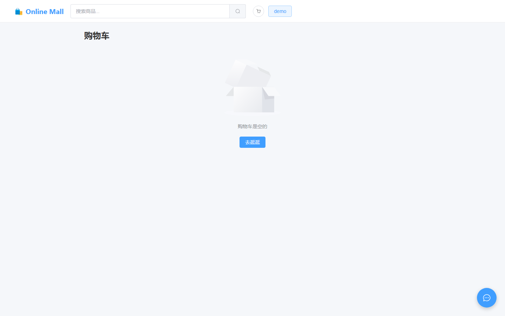
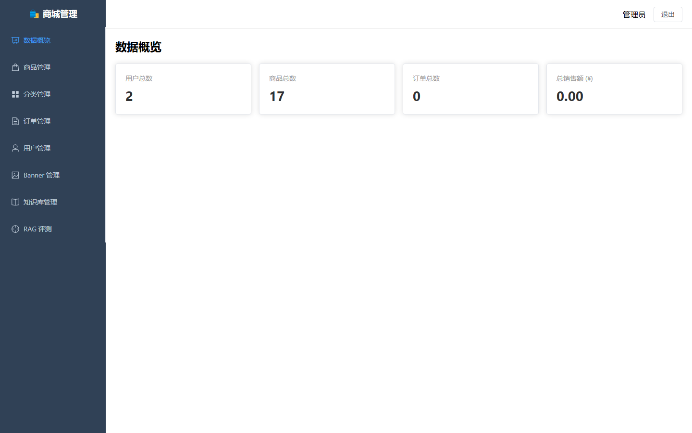
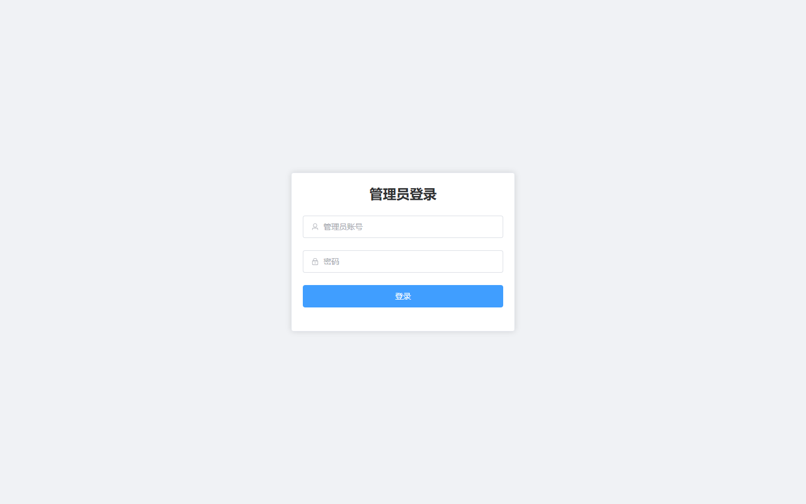

# Online Mall —— 基于 LangChain 的 AI 智能客服商城系统（V2）

[](https://github.com/TheQing1/online-mall-system/actions/workflows/ci.yml)
[](LICENSE)
[](backend/requirements.txt)
[](frontend/package.json)

综合 B2C 在线商城，集成了基于 **LangChain + RAG + DeepSeek** 的 AI 智能客服，
并补齐了商品 SKU、页面化模拟支付、订单超时关单、退款、收藏、Banner 运营、
多轮 AI 会话、RAG 评测等完整链路。

## 亮点速览

- **防超卖**：`UPDATE ... WHERE stock >= ?` 原子条件更新 + `rowcount` 判断，
  并在**真实 MySQL/InnoDB** 上用 8 线程并发测试验证（恰好 3 单成交）；
- **订单状态机**：白名单校验流转合法性，所有流转用条件 UPDATE 做乐观并发控制，
  并发支付幂等性也在真实 InnoDB 上验证过；
- **RAG 可量化**：自建 22 篇知识文档 + **51 条评测集**（其中 31 条是口语化改写、
  还刻意放了多组近义干扰文档）。同一套评测集、同一条线上代码路径上测出三级提升：
  纯向量 recall@1 84.3% → **BM25 混合检索 90.2%** → **再加交叉编码器重排 92.2%，
  且 recall@3 达到 100%**（进 Prompt 的就是 top-3）；
- **工程化**：Alembic 幂等迁移（**可回滚**，有真实 MySQL 往返用例）、113 个 pytest 用例（覆盖率 77%）、
  **10 个 Playwright 端到端用例**（真浏览器 + 控制台零报错 + 样式生效断言）、
  GitHub Actions CI、Docker Compose 一键部署（多阶段镜像 + 非 root + HEALTHCHECK）；
  前端 Element Plus 按需引入，`dist` 体积减半（1579KB → 762KB）。
- **抗读压力与防滥用**：商品读路径走 Redis 缓存（50 并发实测 **P99 51ms → 23ms**，
  中位数 8ms → 5ms），并针对缓存的三个经典问题都做了防护——**击穿**（热点 key 过期时
  按 key 单飞，10 个并发只查一次库）、**穿透**（查不到的 id 走短 TTL 负缓存）、
  **雪崩**（TTL 抖动）；全站兜底限流 + 登录/下单/AI 对话的独立配额；关单任务用 Redis
  分布式锁串行化并拆成独立 worker，API 进程可以放心多副本；**Redis 不可用时自动降级**，
  只丢缓存和限流、不影响业务。
- **可观测性闭环**：结构化日志 + request_id（响应头回写）、Prometheus 指标
  （请求/延迟/缓存命中/限流拦截/依赖可用性/定时任务），并配好 **6 条告警规则 +
  Grafana 看板**——不是「有指标」，而是「指标有人看、出事有人管」。

## 技术栈

| 层级 | 技术 |
|------|------|
| 商城前端 | Vue3 + Element Plus + Vite + Pinia |
| 管理后台 | Vue3 + Element Plus + Vite（独立入口，`/admin/` 子路径部署） |
| 后端 API | FastAPI + SQLAlchemy 2.0 + Pydantic v2 |
| 数据库 | MySQL 8.0（Alembic 迁移管理，14 张表） |
| 缓存/限流/锁 | Redis 7（不可用时自动降级为无缓存、不限流，见 `app/core/cache.py`） |
| 可观测性 | 结构化日志 + request_id + Prometheus + Grafana + 告警规则 |
| 向量存储 | ChromaDB（原生客户端，本地持久化） |
| 检索 | 向量召回 + BM25（jieba 分词）加权融合，可选交叉编码器重排，见 `app/ai/retriever.py` |
| AI 框架 | LangChain 0.3.x（RAG：切片 → BGE Embedding → 混合检索 → 生成） |
| Embedding | BGE `bge-small-zh-v1.5`（本地部署，ModelScope 下载） |
| 大模型 | DeepSeek（OpenAI 兼容接口，模型名 `deepseek-flash`） |
| 认证 | JWT（python-jose + bcrypt） |
| 部署 | Docker Compose + Nginx（多阶段构建、非 root、HEALTHCHECK、自动迁移 + 种子数据） |
| 测试 | pytest + httpx（113 个用例：认证/订单全流程/越权/回归/搜索/缓存与限流/上传校验/迁移回滚/RAG 召回与重排/真实 MySQL 并发） |
| 质量 | ruff + pytest-cov + ESLint + Prettier + GitHub Actions |

## 功能概览

### 商城前台
- 首页：Banner 运营位（后台可管理）+ 分类 + 热销推荐
- 商品：多规格 SKU（独立价格/库存）、收藏、详情图片
- 购物车：按 SKU 加购/改数量/删除、总价计算
- 下单：选地址 → 确认订单（SKU 快照）→ 待支付
- 支付：页面化模拟收银台（下单 30 分钟未支付自动关单并回补库存）
- 订单：取消、确认收货、申请退款（退款原因/审核流转/库存销量回滚）
- 用户：注册/登录、地址管理、我的订单、我的收藏
- AI 客服：多轮会话（历史持久化）、检索改写、商品推荐卡片、快捷问题

### 管理后台
- 数据看板：用户/订单/销售额/退款待处理
- 商品管理：CRUD + 上/下架 + 多 SKU 规格/价格/库存编辑
- 分类 / 用户管理
- 订单管理：按状态/单号筛选、状态流转、详情、退款审核（同意/驳回）
- Banner 管理：运营位增删改、上下线、排序
- 知识库：文档 CRUD + 批量导入 .md/.txt（增量同步向量索引）
- RAG 评测：测试用例管理 + 一键评测召回命中率

## 界面速览

| 商城首页 | 商品详情（多规格 SKU） |
|---|---|
|  |  |

| AI 客服（多轮 + 商品卡片 + 流式输出） | 购物车 |
|---|---|
|  |  |

| 管理后台 · 数据概览 | 管理后台 · 登录 |
|---|---|
|  |  |

> 截图由 `npm run test:e2e` 的 Playwright 用例自动产出（见「端到端冒烟测试」一节），
> 所以它们不会随着界面改动而过期——每次跑测试都会覆盖一遍。

## 快速开始（开发环境）

### 1. 数据库

MySQL 8.0 建库并升级表结构：

```bash
cd backend
cp .env.example .env        # 如有 .env 直接修改
alembic upgrade head        # 迁移：老库自动补列/回填 SKU，新库自动建表
python -m app.core.seed     # 种子数据：admin/demo 账号、商品、Banner、知识库
```

> 首次运行会自动通过 ModelScope 下载本地 Embedding 模型（约 100MB）。

> **Redis 是可选的**：不启也能跑——缓存、限流、分布式锁都会自动降级
> （见 `app/core/cache.py`），只是性能与防滥用能力打折。本地想开：
> `docker run -d -p 6379:6379 redis:7-alpine`，或用 `.env` 里的 `REDIS_URL` 指到别处。

### 2. 启动后端

```bash
cd backend
uvicorn app.main:app --reload --port 8000
# API 文档: http://localhost:8000/docs
```

### 3. 启动前端

```bash
cd frontend && npm install && npm run dev   # http://localhost:5173
cd admin    && npm install && npm run dev   # http://localhost:5174/admin/login
```

## 本地一键启动（Docker）

```bash
cp .env.example .env          # 标了【必须改】的两项，本地随便填也行
DEEPSEEK_API_KEY=sk-xxx docker compose up -d --build

# 服务就绪后访问
# 商城:  http://localhost
# 管理:  http://localhost/admin/login
# API:   http://localhost:8000/docs
```

`backend` 容器启动时自动执行 `alembic upgrade head` → 种子数据 → 启动 API；
**首次**启动的种子数据会同步向量索引，顺带下载约 100MB 的 BGE 模型，等几分钟是正常的
（healthcheck 的 `start_period` 为此给到 300 秒；预热过之后只要十几秒，见下面的部署一节）。
Nginx 负责 `/api`、`/static` 反代与两个 SPA 静态托管。

> 根目录的 `.env` 是给 **docker compose** 用的（容器之间怎么连、部署密钥、对外端口）；
> `backend/.env` 是给**不用 Docker、直接在宿主机跑 uvicorn** 用的。两份不能混着抄——
> 容器里连的是 `mysql` / `redis` 这两个服务名，不是 `localhost`。

Compose 一共 5 个服务：`mysql`、`redis`、`backend`（API）、`worker`（定时任务，与 backend
同镜像不同入口）、`web`（Nginx + 两个前端产物）。API 进程里 **不跑**定时任务
（`RUN_BACKGROUND_TASKS=false`），所以 backend 可以放心扩到多副本。

另外还有两个**可观测性服务**，默认不启（镜像加起来几百 MB，而「看一眼商城」并不需要它们）：

```bash
docker compose --profile observability up -d   # 额外起 prometheus + grafana
# Prometheus: http://localhost:9090    Grafana: http://localhost:3000（admin / admin）
```

只要指标本身的话不需要任何额外服务：`curl localhost:8000/metrics` 就能拿到
（nginx 没有反代 `/metrics`，所以它不随站点对外暴露）。

## 部署到服务器（在线 Demo）

一台能跑 Docker 的 Linux 服务器 + 一个域名就够了。整条链路一条命令：

```bash
git clone https://github.com/TheQing1/online-mall-system.git
cd online-mall-system
sudo bash deploy/bootstrap.sh
```

脚本会依次做完：装 Docker → **生成随机数据库口令和 JWT 密钥**写进 `.env` →
校验配置 → 构建镜像 → 起 MySQL/Redis → 跑迁移与种子数据 →
**预热 Embedding 模型** → 起全部服务 → 跑一遍部署自检。
全程可以无人值守：

```bash
DOMAIN=mall.example.com DEEPSEEK_API_KEY=sk-xxx sudo -E bash deploy/bootstrap.sh
```

### 为什么要有这些步骤，而不是 `compose up` 就完事

每一件都对应一个具体的失败形态，不是「最佳实践」清单：

| 补的东西 | 不补会怎么样 |
|---|---|
| `deploy/check-env.sh` | compose 对几乎每个变量都给了能跑的默认值，所以漏配不报错，只表现成「站点能开但认证形同虚设」——浏览器里完全看不出来 |
| 模型预热放在 `up -d` 之前 | 第一个访问的人替我们下载 100MB 模型；期间 backend 一直 unhealthy，`web`（`depends_on: service_healthy`）根本不会启动，看起来像「部署失败」却查不出原因 |
| `docker-compose.prod.yml` 要求密钥必须显式给值 | `JWT_SECRET_KEY` 悄悄回落到 `change-me-in-production`，任何人都能签一个管理员 token 登进后台 |
| 日志轮转（`max-size` / `max-file`） | docker 的 json 日志默认无限增长，demo 挂几个月能把 20G 系统盘写满 |
| `deploy/smoke.sh` | `/health` 只证明进程活着。「能打开但白屏」「搜索没结果」「种子数据没进库」这些它全都发现不了，而它们恰恰是最常见的翻车方式 |

<details>
<summary>一键脚本万一失败：手动步骤（等价，6 条命令）</summary>

脚本本身没做任何魔法，出问题时照着敲一遍就能定位到是哪一步：

```bash
cp .env.example .env
# 手改 .env：
#   MYSQL_ROOT_PASSWORD=$(openssl rand -hex 16)
#   JWT_SECRET_KEY=$(openssl rand -hex 32)
#   API_BIND=127.0.0.1                     # 调试端口不对外
#   没有域名：WEB_BIND=0.0.0.0  WEB_HTTP_PORT=80
#   有域名：  WEB_BIND=127.0.0.1 WEB_HTTP_PORT=8080  DOMAIN=你的域名
sh deploy/check-env.sh                     # 有域名加 --tls

COMPOSE="docker compose -f docker-compose.yml -f docker-compose.prod.yml"

$COMPOSE build
$COMPOSE up -d mysql redis
# 迁移 + 种子数据 + 预热模型，都在这一步做完（跑在 `up -d` 之前是关键）
$COMPOSE run --rm backend sh -c \
  'alembic -c /app/alembic.ini upgrade head && python -m app.core.seed && python -m app.ai.warmup'
$COMPOSE up -d

sh deploy/smoke.sh                         # 有域名改成 BASE_URL=https://你的域名
```

有域名的版本还要给每条命令加 `-f docker-compose.tls.yml`。

</details>

### HTTPS（有域名才需要）

填了 `DOMAIN` 时 bootstrap 会自动叠上 Caddy，由它向 Let's Encrypt 申请并续期证书，
HTTP 自动跳 HTTPS——不需要写任何定时任务。手动起是：

```bash
docker compose -f docker-compose.yml -f docker-compose.prod.yml \
               -f docker-compose.tls.yml up -d
```

> 前置条件只有一个：启动前域名已经解析到本机公网 IP，且 80/443 能从公网访问
> （Let's Encrypt 校验域名所有权必须走这两个端口）。没有域名就**不要**叠这一层，
> 直接用 `http://服务器IP` 访问，功能完全一样，只是浏览器会提示不安全。

### 部署自检与重置

```bash
sh deploy/smoke.sh                                  # 默认测 http://localhost
BASE_URL=https://mall.example.com sh deploy/smoke.sh  # 测线上
```

它从「用户真正访问的那个地址」出发走一遍关键链路：后端存活 → 两个前端首页 →
构建产物真的在镜像里 → 商品接口与种子数据 → **搜「鞋子」能命中「运动鞋」**
（这是历史上真出过问题的回归点，放进自检里守着）→ 普通用户登录 → 管理后台看板 →
**后台传一张图（验证容器里上传目录真的可写）** → AI 客服 SSE。
没有配 DeepSeek Key 时 AI 那一条是**警告**而不是失败——商城本身是完整的，
但会明确告诉你「演示 AI 能力必须补上这个 Key」。

公开的 demo 站谁都能注册、下单、改后台，演示前发现首页躺着几笔乱七八糟的订单很正常：

```bash
sudo bash deploy/reset-demo.sh      # 只重建 MySQL 数据卷，模型缓存不动，约 1 分钟
```

## 5 分钟能看到什么（演示动线）

如果只有五分钟，按这个顺序走，每一步都对应一个能讲的技术点：

| # | 操作 | 背后在做什么 |
|---|---|---|
| 1 | 打开首页，随便逛逛分类和商品详情 | 商品读路径走 Redis 缓存（50 并发实测 P99 51ms → 23ms），缓存带击穿/穿透/雪崩三道防护 |
| 2 | 搜索框里搜「鞋子」（库里商品名是「运动鞋」），再试「mate60」「Ｍａｔｅ６０」「512G」 | 查询理解层：NFKC 归一化 + 分词 + 同义词表 + AND→OR 兜底。规则是数据不是代码，加词只加一行 |
| 3 | 打开右下角 AI 客服，问「你们支持七天无理由退货吗」，接着追问「那运费谁出」 | 多轮会话改写 → 混合检索（向量 + jieba BM25 加权融合）→ DeepSeek 流式生成，边收边渲染 |
| 4 | 用 demo/demo123 登录，选 SKU 加购、下单、进收银台支付 | SKU 快照、订单状态机（白名单流转 + 条件 UPDATE 乐观并发）、30 分钟未支付自动关单并回补库存 |
| 5 | 换 admin/admin123 进 `/admin/login`，看数据看板 → 商品管理 → 退款审核 → RAG 评测点一次「一键评测」 | 后台全部走管理员鉴权；RAG 评测跑的是**和线上同一条** `retrieve()`，不是另写一份 |
| 6 | `http://127.0.0.1:8000/metrics`（仅本机）或 `--profile observability` 起的 Grafana | 请求量/延迟/缓存命中/限流拦截/依赖可用性/定时任务，配 6 条告警规则 + 看板 |

## 默认账号

| 角色 | 用户名 | 密码 |
|------|--------|------|
| 管理员 | admin | admin123 |
| 演示用户 | demo | demo123 |

## 环境变量（backend/.env）

```env
MYSQL_HOST=localhost
MYSQL_PORT=3306
MYSQL_USER=root
MYSQL_PASSWORD=your_password
MYSQL_DATABASE=online_mall

JWT_SECRET_KEY=your-secret-key-change-me
JWT_ALGORITHM=HS256
JWT_EXPIRE_MINUTES=1440
ORDER_EXPIRE_MINUTES=30

DEEPSEEK_API_KEY=sk-your-deepseek-api-key
DEEPSEEK_BASE_URL=https://api.deepseek.com
DEEPSEEK_MODEL=deepseek-flash

UPLOAD_DIR=static/products
MAX_UPLOAD_SIZE=2097152
```

> 完整清单见 `backend/.env.example`。`backend/.env` 含真实密钥，已被 `.gitignore` 忽略，
> 请勿提交或打包外发。

用 Docker 部署时改的是**根目录**那份，变量不一样（管的是容器编排而不是应用配置）：

```bash
cp .env.example .env
openssl rand -hex 16   # → MYSQL_ROOT_PASSWORD
openssl rand -hex 32   # → JWT_SECRET_KEY
```

完整清单见根目录 `.env.example`，每一项都有注释说明「不填会怎样」。
部署前可以先自查一遍：`sh deploy/check-env.sh`（加 `--tls` 连 HTTPS 的配置一起查）。

## 项目结构

```
├─ frontend/            # 商城前台 (Vite :5173)
├─ admin/               # 管理后台 (Vite :5174，生产构建至 /admin/)
├─ backend/
│  ├─ app/api           # 路由层（REST + SSE）
│  ├─ app/services      # 业务层
│  ├─ app/models        # SQLAlchemy 模型（14 张表）
│  ├─ app/ai            # RAG 链路（loader/vectorstore/indexer/rag/eval_dataset）
│  ├─ app/core          # 配置/安全/数据库/缓存/限流/锁/日志/指标/后台任务
│  ├─ alembic           # 数据库迁移
│  ├─ tests             # 113 个 pytest 用例
│  └─ data/             # 运行时生成：向量库 + Embedding 模型缓存（已 gitignore）
├─ docs/interview-qa.md # 面试问答（与代码同步维护）
├─ docs/resume-project.md # 简历描述三版 + 数字证据索引
├─ .github/workflows    # CI
├─ web/                 # Nginx 配置 + 前端产物 Dockerfile
├─ deploy/              # 部署：一键脚本 / 配置校验 / 自检 / 演示数据重置 / Caddyfile
├─ docker-compose.yml      # 本地与生产共用的基线
├─ docker-compose.prod.yml # 生产加固层（密钥必填、日志轮转、收紧转发信任）
└─ docker-compose.tls.yml  # 自动 HTTPS 层（Caddy）
```

> `backend/data/`（可用环境变量 `DATA_DIR` 覆盖）刻意放在 Python 包**外面**：
> 早期向量库与模型缓存位于 `app/` 内部，而 compose 用 named volume 挂载同一路径，
> 会把 `app/models/*.py` 一起遮蔽——重建镜像后容器里跑的仍是 volume 中的旧代码。

## 已知不足

诚实地列在这里，避免面试时被动：

- 重排只在 CPU 上跑（每条问题约 0.6 秒）。上生产要么换 GPU，要么换更小的
  cross-encoder；也没有做重排结果的缓存，同一个问题反复问会重复计算；
- 前端无 TypeScript、无单元测试；端到端测试（10 个 Playwright 用例）已经进 CI，
  但它只覆盖「页面能用」这一层，组件内部的逻辑仍然没有单测兜着；
  商城前台的全局路由守卫已是唯一权威判断，
  但各页面里还留着早期手写的 `onMounted` 登录判断（现在属于冗余代码，可删）；
- JWT 存 localStorage、无 refresh token；
  仓库里给了 HTTPS 的通路（`docker-compose.tls.yml` + Caddy 自动签发续期），
  但**当前这份 demo 是不是真的跑在 HTTPS 上取决于部署时填没填 `DOMAIN`**——
  没域名就是纯 HTTP。另外 nginx 里的 HSTS 仍是注释状态，等真在 TLS 后面终结后再开；
- **本地** compose 把 backend 的 8000 直接映射到宿主机（方便看 `/docs`），
  而 entrypoint 默认 `--forwarded-allow-ips='*'`，所以本地那套是有折扣的信任：
  能直连 8000 的客户端可以伪造 `X-Forwarded-For`。生产路径上这两个口子都收掉了
  （`deploy/bootstrap.sh` 写 `API_BIND=127.0.0.1`，prod 层把信任范围收成 Docker 网段），
  由 `deploy/check-env.sh` 在启动前断言——但这是「部署脚本保证」，不是「配置文件保证」，
  手写 `docker compose up` 还是可能漏；
- 缓存只做了 Redis 单级 + 进程内单飞：Redis 挂掉的降级期内读请求会直接压到 MySQL，
  多副本部署时单飞也只在进程内生效（要彻底解决得用分布式单飞 + 本地多级缓存）；
- 限流是固定窗口，窗口边界可能出现两倍突发；也没有按用户等级/接口成本做差异化配额；
- 告警规则写好了，但没有接通知渠道（Alertmanager / 钉钉机器人），
  也没有做指标的长期存储与容量规划；
- 模型缓存首次启动需联网从 ModelScope 下载（约 100MB）。部署脚本会把它**提前**
  下好（`python -m app.ai.warmup`），但这件事本身没被绕过：国内小带宽机器上
  第一次部署仍要等几分钟，网络不通就是起不来；
- 上传做了扩展名白名单 + 文件头（魔数）校验，但魔数挡不住精心构造的多格式文件，
  彻底的做法是解码后重新编码再落盘；商品图仍存本地盘，生产应上对象存储。

> 已修复、因此不再列在上面的：模型缓存曾放在 Python 包内部（compose 的 volume 会遮蔽
> `app/models/*.py`，重建镜像后容器仍在跑旧代码）；`orders` 缺少覆盖「每 30 秒定时关单
> 扫描」的索引；后端镜像 root 运行、无 HEALTHCHECK；nginx 默认 `client_max_body_size`
> 为 1m 导致传图必然 413；商城前台没有全局路由守卫；`/placeholder.png` 资源缺失。
>
> 这一轮补掉的：V2 迁移的 `downgrade()` 从 `pass` 变成**真实可用的回滚**
> （有真实 MySQL 的 upgrade→downgrade→upgrade 往返用例守着）；上传补了**文件头（魔数）校验**，
> 改个后缀传脚本会被拒；限流从「只有三个接口」变成**全站兜底 + 分接口配额**；
> 缓存补了**击穿 / 穿透 / 雪崩**三道防护；加了 **6 条告警规则 + Grafana 看板**；
> 10 个端到端用例**进了 CI**。
>
> 部署这一轮补掉的：`deploy/bootstrap.sh` 一条命令从裸机到可访问（含装 Docker、
> 生成随机密钥、预热模型）；`deploy/check-env.sh` 把「漏配但照样能跑起来」的配置
> 挡在启动前；`deploy/smoke.sh` 从用户入口走一遍关键链路；`docker-compose.prod.yml`
> 要求密钥必须显式给值并加日志轮转；`docker-compose.tls.yml` 用 Caddy 自动签发并
> 续期证书；商品图上传目录从「bind mount 到仓库里」改成命名卷——容器以 uid 1000 运行，
> 而宿主机那个目录归谁取决于「谁 clone 的仓库」，root clone 再 sudo 部署就写不进去，
> 后台传图直接 500，报错位置离原因还很远；部署自检里补了一条「真传一张图」把这类问题钉住。
>
> 部署这套东西**验证到哪一步了**（说清楚，免得当成已经万无一失）：镜像能不能构建出来、
> 三层 compose 的合并结果对不对，由 CI 每次提交验证；`check-env.sh` 的判定逻辑有反向
> 用例（喂坏配置必须被拒）；脚本语法也在 CI 里过一遍。**没有验证过的是
> `bootstrap.sh` 在真实服务器上的端到端执行**——开发机是 Windows，跑不了
> `get.docker.com` 与 systemd 那条路径。第一次上服务器时请留意，README 里有等价的手动步骤兜底。

## 运行测试

```bash
python -m venv .venv
.venv\Scripts\pip install -r backend/requirements-dev.txt   # Windows
cd backend
../.venv/Scripts/python -m pytest
```

**默认 96 个用例完全自包含**：不需要 MySQL、Redis、联网——用例跑在 SQLite 上，
向量部分使用确定性假 Embedding、重排用桩模型。CI 里额外跑 `ruff check` 与覆盖率。

另外 **17 个用例需要真实基础设施**，连不上时自动 skip、不会让 CI 变红（CI 里由
`infra-integration` 任务起真容器跑，并且「被 skip 就判定失败」）：

```bash
cd backend && pytest -m mysql -v    # 5 个：并发防超卖 / 幂等支付 / 外键 / InnoDB 校验 / 迁移回滚
cd backend && pytest -m redis -v    # 13 个：缓存三层防护 / 限流配额 / 分布式锁互斥
```

按模块运行：

```bash
pytest tests/test_security.py -v        # 越权与鉴权
pytest tests/test_regressions.py -v     # 15 个已修复缺陷的回归
pytest -m rag_quality -s                # 真实 BGE 模型的召回率（无模型缓存时自动 skip）
pytest -m mysql -v                      # 真实 MySQL / InnoDB 集成（连不上时自动 skip）
```

### 端到端冒烟测试（Playwright，10 个用例）

真浏览器跑真页面：首页渲染、商品详情、搜索、登录、购物车、AI 客服面板、后台登录与看板，
并断言**控制台没有任何报错**。这个检查很值钱——组件没注册、`v-loading` 指令没注册、
资源 404、按需引入后样式没进来（用计算样式断言）都是它抓出来的。

```bash
# 1) 后端跑在 :8000（配额调大，见下面的说明）
cd backend && RATE_LIMIT_API=0 RATE_LIMIT_LOGIN=1000 uvicorn app.main:app --port 8000
# 2) 两个前端跑**生产产物**（与 CI 一致；dev server 的依赖预构建会在首次请求时
#    报 504 Outdated Optimize Dep，被「控制台零报错」的断言抓成失败）
cd frontend && npm run build && npm run preview     # http://localhost:5173
cd admin    && npm run build && npm run preview     # http://localhost:5174/admin/
# 3) 跑测试
cd frontend && npm run test:e2e
```

CI 里有一个独立的 `e2e` 任务跑这套用例（起 MySQL + Redis + API + 两个前端）。

> 本地跑之前要把后端限流配额调大：全站兜底是 300/分，登录是 10/分，
> 而 E2E 一轮要发几十个请求、登录 3 次，连跑几轮就会自己撞上 429。
> 这不是 bug，是限流真的在生效——测试环境的正确做法是放宽配额：
> `RATE_LIMIT_API=0 RATE_LIMIT_LOGIN=1000 uvicorn app.main:app --port 8000`。

覆盖范围：注册/登录/JWT、商品列表/详情/SKU、购物车库存校验（含累加上限）、
下单 → 支付 → 发货 → 确认收货 → 退款全流程、取消回补库存、订单超时自动关单、
会话越权（403）、管理端鉴权、知识库增量索引、RAG 召回率评测，以及
**真实 InnoDB 上的多线程并发防超卖**与**并发支付幂等性**。

### 在真实 MySQL 上验证过的并发结论

`tests/test_mysql_integration.py` 在 MySQL 8.0.43 上实测：

| 场景 | 结果 |
|------|------|
| 8 线程并发抢 3 件库存 | 恰好 3 单成功，SKU 与商品聚合库存同时归零 |
| 同一订单 5 次并发支付 | 恰好 1 次成功，销量只累加 1 |
| 删除已被下单的商品 | 抛出 IntegrityError（证明服务层的拦截是必要的） |

失败的线程只接受 `库存不足 / 状态不允许` 这种业务错误；其他异常一律抛出，
避免「恰好 3 单成功」是因为别的原因失败而侥幸通过。

### RAG 召回率（真实模型实测）

`tests/test_rag_quality.py` 加载真实的 `bge-small-zh-v1.5`，对 **22 篇**知识文档建索引，
按生产同款参数（相关性下限 0.3 ≡ 原余弦距离 0.7、top-3）在 **51 条评测用例**上评测。
评测与线上生成调用的是同一个 `retriever.retrieve()`，而不是各写一份。

| 检索策略 | recall@1 | recall@3（进 Prompt 的 top-3） |
|----------|----------|------------------------------|
| 纯向量 | 84.3% | 94.1%（48/51） |
| **向量 + BM25 融合（当前默认）** | **90.2%** | **98.0%（50/51）** |
| 再加交叉编码器重排（`RAG_RERANK_ENABLED=true`） | **92.2%** | **100%（51/51）** |

融合权重扫过 5 组（0.7/0.3 → 0.3/0.7），0.6/0.4 在 recall@1 与 recall@3 上同时最优。
`test_hybrid_retrieval_is_not_worse_than_vector` 就是防止后续调参把它调坏的回归用例。

**为什么重排默认关闭**：它首次使用要多下载 1.1GB 的 `bge-reranker-base`，之后每条问题
在 CPU 上多花约 0.6 秒（10 条候选，实测）。收益是 recall@3 从 98% 到 100%、recall@1 再
提 2 个百分点——值不值取决于场景，所以做成一个开关，而不是替你决定。想开就在 `.env` 里
设 `RAG_RERANK_ENABLED=true`。

三个真实的坑（都是被这套评测用数据抓出来的，不是看文档看出来的）：

- `BM25Okapi` 的 IDF 在「某个词出现在超过一半文档里」时是**负数**，于是命中了这个词的
  文档得分反而低于完全没命中的文档（小语料上尤其致命，而本项目的知识库刚好充满
  「商品」「订单」「配送」这类高频词），因此改用 IDF 恒非负的 `BM25Plus`；
- 评测脚本用 `"bge" in 路径` 去模型缓存里找 Embedding 模型，而新下载的重排模型
  `bge-reranker-base` 也含 "bge"，于是**重排模型被当成 Embedding 加载**，
  向量召回从 84.3% 直接掉到 3.9%。这类「命名撞车」在缓存目录里非常隐蔽，
  现在改成精确匹配模型目录；
- BGE **v1.5 不需要** query 指令前缀（那是 v1 的要求），加上反而使平均余弦距离
  从 0.357 劣化到 0.401，因此代码中刻意不加，详见 `app/ai/vectorstore.py` 注释。

> 评测集从 20 条扩到 51 条、文档从 10 篇扩到 22 篇并加入近义干扰文档之后，
> 纯向量的绝对分数比早期版本低——这是评测变难的正常结果，也让「混合检索到底值不值」
> 有了可比的数据。

## 性能与压测（50 并发 / 30 秒，单 worker）

`backend/loadtest/locustfile.py` 模拟逛商城的读路径（列表 → 详情 → 搜索 → 分类/Banner），
同一套脚本分别在**开着缓存**和**关掉缓存**的实例上各跑一轮：

| 指标 | 关闭 Redis 缓存 | 开启 Redis 缓存 |
|---|---|---|
| 总请求数 / 失败数 | 4455 / **0** | 4547 / **0** |
| 吞吐 | 150.3 req/s | 153.3 req/s |
| 中位数 | 8 ms | **5 ms** |
| P95 | 25 ms | **11 ms** |
| P99 | 51 ms | **23 ms** |
| 最长 | 350 ms | 85 ms |

**怎么读这张表**：吞吐几乎没变，但延迟（尤其尾部）几乎减半。原因是 50 并发对
单 worker + 本地 MySQL 来说远没到瓶颈——瓶颈在 CPU 与连接池，不在数据库。
想看出吞吐差异得压到更高并发，或者换成更重的查询。**缓存的价值在这里体现为
延迟与尾延迟，不是吞吐**，把结论说成「缓存让 QPS 翻倍」就是不诚实的。

另外两个诚实的边界：

- 压测**没有包含登录与下单**：登录按 IP 限流（10 次/分钟），压测会直接撞 429，
  那是限流器的性能而不是业务的性能；下单是有状态写路径，混在一起测没有解释力。
  想压写路径请单独写用户类并调大限额，脚本注释里写了做法。
- 单 worker 单机，**不代表生产容量**——它证明的是「加了这些之后没有把读路径拖慢」，
  以及缓存确实在起作用。

## 可观测性

后端在 `/metrics` 暴露 Prometheus 指标（nginx 没有反代它，只对本机/监控网段可见）：

| 指标 | 用途 |
|---|---|
| `http_requests_total{method,path,status}` | 按**路由模板**聚合——用原始路径的话每个商品 id 都是一条时间序列，label 基数会炸 |
| `http_request_duration_seconds` | 延迟直方图，算 P95 / P99 |
| `cache_operations_total{result}` | 命中 / 未命中 / 写入 / 负缓存：看缓存到底有没有在起作用 |
| `rate_limit_blocked_total{scope}` | 被限流拦截的次数：既看滥用，也看「配额是不是配紧了误伤正常用户」 |
| `redis_up` | Redis 是否可用（0 = 已降级为无缓存、不限流） |
| `background_task_runs_total{task,result}` | 定时任务执行 / 跳过 / 失败——关单失败会直接导致库存不回补 |

配上 6 条告警规则（5xx 比例、P99 超 1 秒、Redis 降级、限流激增、定时任务失败、
十分钟没有流量）和一块 Grafana 看板：

```bash
docker compose --profile observability up -d
# Grafana http://localhost:3000（admin/admin）里会自动出现「Online Mall · API 概览」看板
```

> 为什么自己用 `prometheus_client` 写指标，而不是用 `prometheus-fastapi-instrumentator`：
> 后者 8.x 要求 `starlette>=1.0`，与本项目锁定的 FastAPI 0.115（要求 `<0.39`）冲突，
> 装上 `pip check` 直接报依赖不一致。自己写不到 60 行，还能**复用访问日志里已经算好的
> 耗时**（计时只做一次，两个消费者）。

> 已知边界：告警规则写好了，但没接通知渠道（Alertmanager / 钉钉机器人），
> 也没有指标的长期存储与容量规划。

## 代码质量

```bash
cd backend && ruff check .                      # 静态检查（F/E9：只拦真 bug）
cd backend && pytest --cov=app --cov-report=term-missing   # 当前 77%，CI 门槛 70%

cd frontend && npm run lint && npm run build    # 两个前端都需 lint + 构建通过
cd admin    && npm run lint && npm run build
cd frontend && npm run test:e2e                 # 端到端冒烟（需先起三个服务）
```

**前端产物体积**：Element Plus 改成按需引入后（`unplugin-vue-components` +
`ElementPlusResolver`），两个前端的 `dist` 从 1579KB / 1600KB 降到 **762KB / 797KB**，
主 chunk 从 777KB / 1167KB 降到 103KB / 517KB。
代价是三个地方要自己处理：服务式组件（`ElMessage`/`ElMessageBox`）与指令（`v-loading`）
不走模板解析、插件管不到，样式要显式引；中文 locale 也要从
`app.use(ElementPlus, { locale })` 改成 `<el-config-provider>`。
这三件事都由端到端测试守着（见上）。

ESLint / Prettier 配置与依赖都已就位（`eslint.config.mjs` / `.prettierrc` +
`devDependencies`），`npm run lint` 与 `npm run format` 直接可用，CI 里也会跑 lint。
规则只开「正确性」、不引格式规则，格式交给 Prettier，避免两套工具互相打架。

## 核心设计说明

- **SKU 化交易**：购物车/订单按 SKU 计价扣库存，商品表 `price/stock` 为聚合展示值。
- **搜索**：查询理解单独成层（`app/services/search.py`），把「用户敲的字」和「文案写的字」
  对齐。三类差异各有对策——**形式差异**（空格、连字符、大小写、全角、容量单位写法
  `512G`/`512GB`）由统一归一化管道消除，查询侧和文案侧走同一个 `normalize()`；
  **分词差异**用 jieba 把中文长词切开（「华为手机」→ 华为 + 手机）；**用词差异**
  （「鞋子」vs「运动鞋」、「苹果」vs iPhone）没有算法能推，只能靠数据，单独放在
  `search_synonyms.py` 里维护。词间 AND，只有 AND 一条都没有时才退化为 OR，
  避免「一个词不认识就整页空白」。覆盖商品名、描述、分类名与 SKU 名称，默认按名称命中数排序。
  代价：`%keyword%` 用不到索引，数据量大要换成物化搜索列或搜索引擎。
- **防超卖**：扣减用 `UPDATE ... WHERE stock >= ?` 原子条件更新，以 `rowcount` 判断成败，
  无需额外加锁；SKU 与商品聚合库存同一事务内扣减。
- **订单状态机**：`pending_pay → paid → shipped → completed`；待支付可取消；
  `paid/shipped/completed` 可申请退款 → `refunding → refunded`；管理端驳回则回到原状态。
  管理端流转受白名单约束，且所有流转都用 `UPDATE ... WHERE status = ?` 做乐观并发控制，
  避免并发重复支付导致销量重复累加、以及自动关单误杀已支付订单。
- **事务原子性**：下单流程（扣库存 + 建订单 + 清空购物车）在**同一个事务**内提交，
  `clear_cart(commit=False)` 不再中途 commit。
- **AI 多轮 RAG**：会话历史存 `chat_sessions/chat_messages`；每轮先做 Query 改写再检索；
  无知识命中时检索商品库并推送商品卡片；回答以 SSE JSON 帧流式返回。
  会话接口有归属校验（他人会话 403、不存在 404），匿名会话可被登录用户认领。
- **增量索引**：知识文档增删改只重建该文档对应向量，不再全量重建。
- **支付扩展点**：当前为页面化模拟收银台（`POST /orders/{id}/pay`）。接微信/支付宝时
  只需把该端点换成「创建支付单 + 异步回调校验」，订单表已预留 `paid_at/refund_*` 等字段。

## 升级说明（V1 → V2）

- 引入 Alembic，移除应用启动时 `create_all`；
- 新增 `product_skus / banners / favorites / chat_sessions / chat_messages / eval_test_cases`；
- `cart_items / order_items` 增加 SKU 维度，`orders` 增加支付/退款字段；
- 支付改为真实“待支付”流程 + 后台 30s 轮询自动关单；
- Chroma 改用原生客户端（移除与新版冲突的 `langchain-chroma`）。

> 老库升级：`cd backend && alembic upgrade head` 会自动补列并对存量商品/购物车/订单回填默认 SKU。
